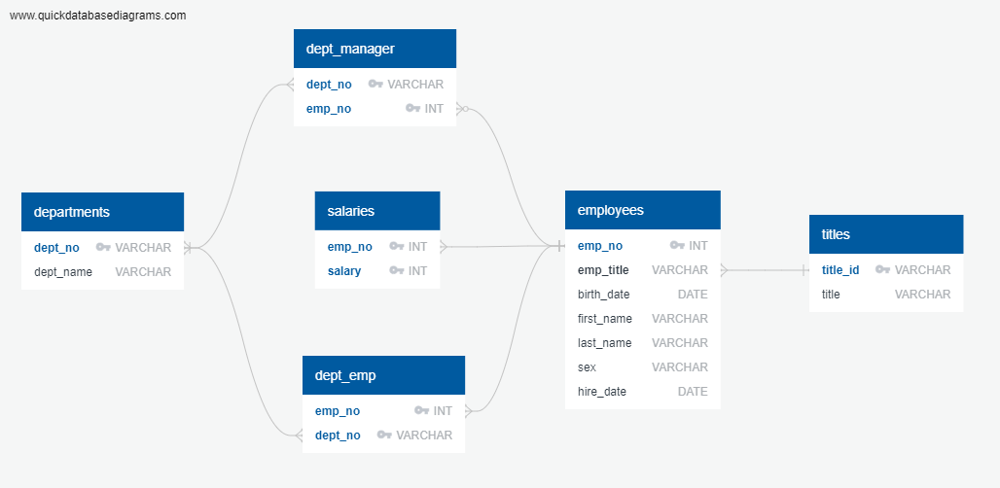
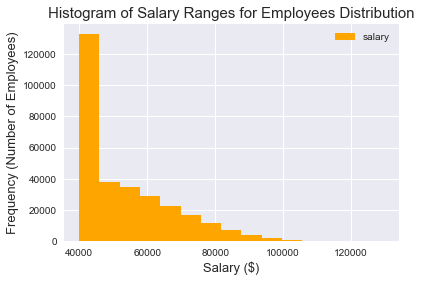
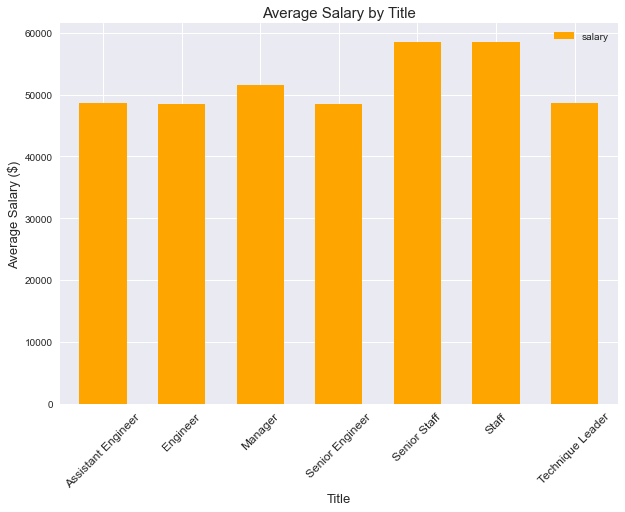

# SQL Challenge - Employee Database

## Table of contents
  * [Introduction](#introduction)
  * [Data Modeling](#data-modeling)
  * [Data Engineering](#data-engineering)
  * [Data Analysis](#data-analysis)
  * [Salary Analysis and Visulization](#salary-analysis)
  * [Technologies](#technologies)

## <a name="introduction"></a> Introduction
This project is a research project on employees of the corporation from the 1980s and 1990s. All that remains of the database of employees from that period are six CSV files. The task is to design the tables to hold data in the CSVs, import the CSVs into a SQL database, and answer the data questions.

* 3 parts in this project are the following:
  * Data Modeling
  * Data Engineering
  * Data Analysis

* Inside an EmployeeSQL folder, you will find the following:
  * "ERD" folder that contains an entity relationship diagram png file and an erd schema text file. 
  * "data" folder that contains six CSV files about employees information.
  * [**table_schemata.sql**](./EmployeeSQL/table_schemata.sql) which is a SQL table schema for each CSV file. 
  * [**query.sql**](./EmployeeSQL/query.sql) to analyze the database and answer the data questions.
  * A jupyter notebook file called [**employee_salary_analysis.ipynb**](./EmployeeSQL/TEST/employee_salary_analysis.ipynb), which is the script to run for the salary analysis and visualization.
  * "Images" folder that contains the plots created.
  
## <a name="data-modeling"></a> Data Modeling
The CSVs were inspected, and an ERD (Entity Relationship Diagram) of the tables was sketched out using a tool called 'Quick DBD.'
 </br>


## <a name="data-engineering"></a> Data Engineering
* Created a table schema for each of the six CSV files using the information and specified data types, primary keys, foreign keys, and other constraints.
* Tables are to be created in the correct order to handle foreign keys.
* Imported each CSV file into the corresponding SQL table. Note be sure to import the data in the same order that the tables were created and account for the headers when importing to avoid errors.
* You can find the table schema sql file is here:

## <a name="data-analysis"></a> Data Analysis
After having a complete database, the analysis was done using SQL queries. You can find the queries sql file here:
The queries will perform the following:
* List the following details of each employee: employee number, last name, first name, sex, and salary.
* List first name, last name, and hire date for employees who were hired in 1986.
* List the manager of each department with the following information: department number, department name, the manager's employee number, last name, first name.
* List the department of each employee with the following information: employee number, last name, first name, and department name.
* List first name, last name, and sex for employees whose first name is "Hercules" and last names begin with "B."
* List all employees in the Sales department, including their employee number, last name, first name, and department name.
* List all employees in the Sales and Development departments, including their employee number, last name, first name, and department name.
* In descending order, list the frequency count of employee last names, i.e., how many employees share each last name.

## <a name="salary-analysis"></a> Salary Analysis and Visulization
To further analyze employees' salary data and visualize the data, Jupyter Notebook and Python were used.

The notebook was created to import the SQL database into Pandas, join the tables needed for the analysis, create a histogram to visualize the most common salary ranges for employees, and finally create a bar chart of average salary by title. Lastly, there is a bonus part to search for employee information whose ID number is 499942.

* **NOTE** 
  * To run this notebook, **psycopg2** has to be installed.
  * You will also need to create a 'config.py' file which contains your postgresql username and password as shown below: 
  ```
  username = "<your postgres username here>"
  password = "<your postgres password here>"
  ```


* The created plots are the following:

 </br>

 </br>


## <a name="technologies"></a> Technologies
Project is created with:
* SQL
* SQLAlchemy 
* Python 3.8
* Jupyter Notebook
* Pandas
* Matplotlib
* QuickDBD
