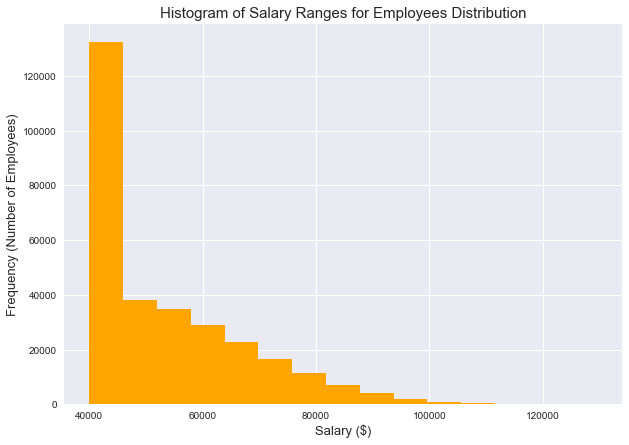

# SQL Challenge - Employee Database

## Table of contents
  * [Introduction](#introduction)
  * [Data Analysis](#data-analysis)
  * [Salary Analysis and Visulization](#salary-analysis)
  * [Technologies](#technologies)

##  Introduction
This project is a research project on employees of the corporation from the 1980s and 1990s. All that remain of the database of employees from that period are six CSV files. The task is to design the tables to hold data in the CSVs, import the CSVs into a SQL database, and answer questions about the data.

* 3 parts in this project are following:
  * Data Modeling
  * Data Engineering
  * Data Analysis

* Inside an EmployeeSQL folder, you will find the following:
  * SQL script
  * A jupyter notebook file called [**employee_salary_analysis.ipynb**](./EmployeeSQL/TEST/employee_salary_analysis.ipynb), which is the script to run for the salary analysis and visualization.
  * An "Images" folder that contains the plots created.

##  Data Analysis

##  Salary Analysis and Visulization
  

  

##  Technologies
Project is created with:
* SQL
* SQLAlchemy 
* Python 3.8
* Jupyter Notebook
* Pandas
* Matplotlib
* QuickDBD
